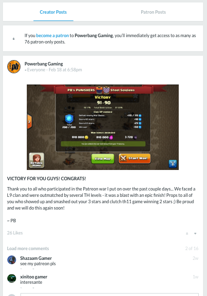
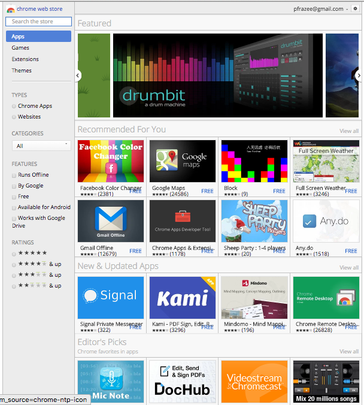
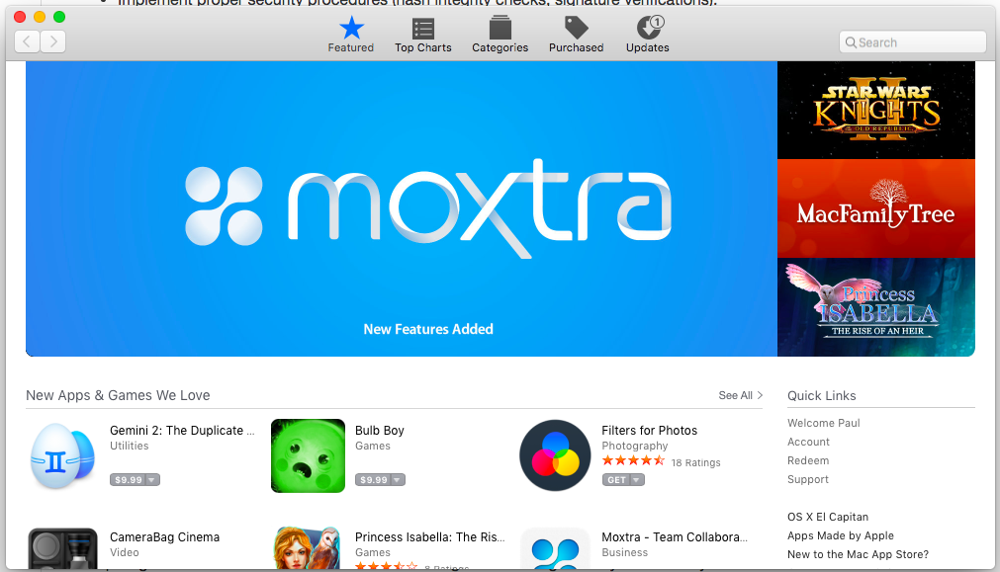
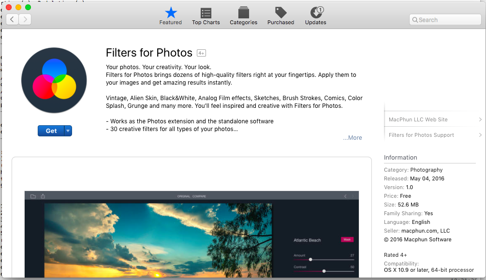
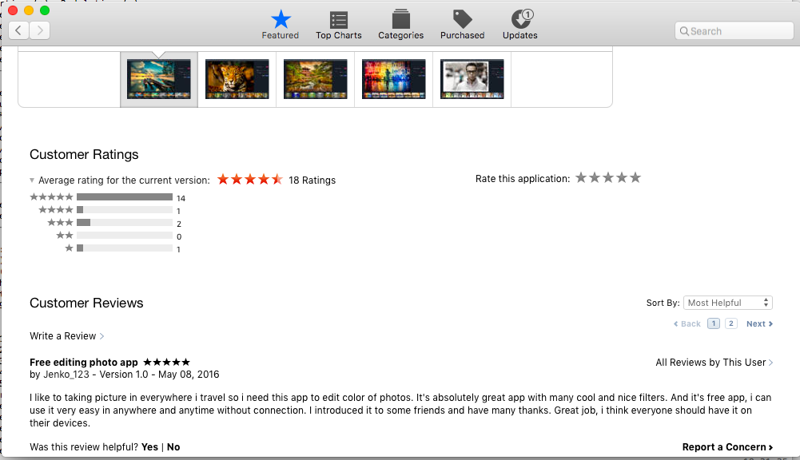
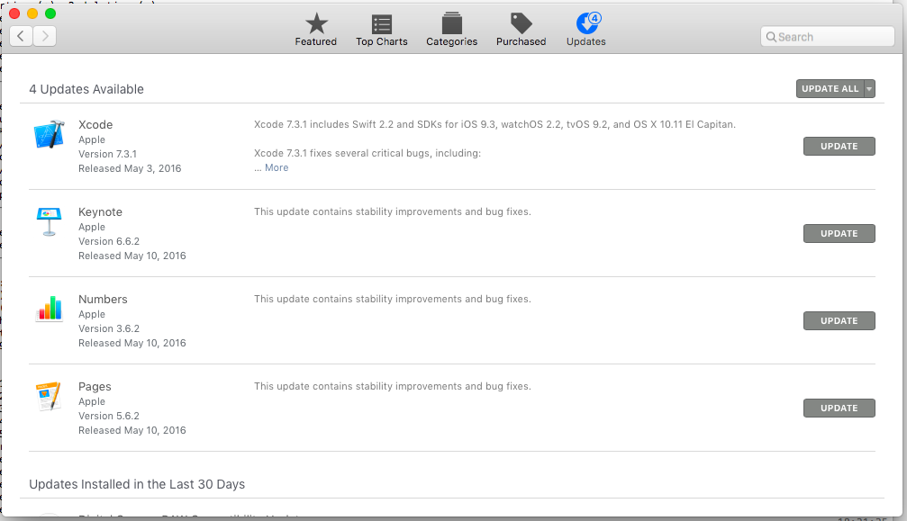

# Publisher project design document

Until we have a name, this project will just be called ThePublisher.

ThePublisher is intended for desktop/notebooks, but it could also be applied to servers.

## Pain points

Pain points we can address:

 - Installer / updater / uninstaller.
 - Managing binary dependencies.
 - Managing services.
 - Creating plugin/module ecosystems.
 - Getting the code, and making changes to, FOSS projects.
 - FOSS revenue.
 - Community engagement.
 - Curation / discovery.

### Installing / Auto-updating / Uninstalling

It sucks to...

 - Implement the installer CLI/GUI.
 - Implement auto-updating.
 - Implement proper security procedures (hash integrity checks, signature verifications).
 - Implement cross-platform setup procedures.
 - Implement cross-platform uninstall.
 - Go through the publishing process.

### Managing binary dependencies

It sucks to have a binary dependency for a project, like a database (Postgres, Redis) or a runtime environment (Node).
The dependency needs to be managed as well as your binary.

Deps get even more complicated when they're shared by binaries, and then multiple dependency versions get involved.

A good toolset for installing & updating deps, and a good strategy for managing versions, would go a long way.

### Managing services

It's not unusual for an application or a dep to need to run persistently.
It can be a pain to manage its lifecycle, and a bunch of forgotten background-services can slow down a user's machine.

A good UI/toolset for managing services would help.

### Creating plugin/module ecosystems

Languages, language-frameworks, and applications will sometimes want to develop an ecosystem of modules or plugins, requiring them to make CLIs and services for hosting and installing.
Usually these ecosystems need to involve a lot of custom rules and processes (consider NPM vs Cargo vs the Atom editor).

How this could be addressed: software installed via ThePublisher could add its own categories of software.
It could then create custom CLIs/GUIs for ThePublisher's APIs, to handle any custom processes, or possibly register the custom processes into ThePublisher.

### Getting the code, and making changes to, FOSS projects

It'd be very cool if you there was a button on a project's page to clone the codebase of a project into a folder.
It'd be even cooler if it was easy to run your custom version in place of the default, whatever that would involve.

### FOSS revenue

Adding purchasing or donations to the toolset would be handy.

### Community engagement

This is what Kickstarter and Patreon do well.
Any software should have, at least, links to where you can get support.
But it's also possible to do project description pages, news feeds, and discussions.

### Curation / discovery

It can be easy to miss new software.
(Conversely, it can be tough to get your software noticed.)

User curation and aggregation could help with this.

## Screenshots of related software

### Patreon

### Chrome store

### OSX App store

